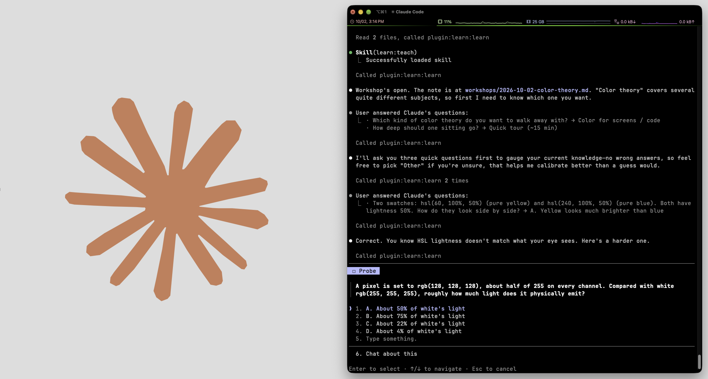

# learn



A teaching system for Claude Code, packaged as a plugin. Adapted from Amos Blomqvist's pi-based system ([How I Use AI to Learn Things](https://www.youtube.com/watch?v=kzcI5F4tGiU), [original repo](https://github.com/amosblomqvist/learn)). The teaching method is his. This version adds persistence, so a course can run over months.

The method has two principles: **unconditional truths first**, and **"how could I have discovered this?"**. Together they build a connected dependency graph in your head instead of a pile of memorized facts. See [`skills/teach/SKILL.md`](skills/teach/SKILL.md).

## Two ways to learn

**Class: long-term, persistent, planned.** A folder per course, such as a grad linear algebra class or a LeetCode track. You drop in the syllabus, notes, slides and problem sets. Claude builds a **knowledge map** (a DAG of ideas), runs a placement probe to find what you already know, then teaches node by node across sessions. It tracks what's solid, what's shaky, and what's due for a re-check. Each time you run `/learn` in the folder, it picks up the right next thing.

**Workshop: one sitting, one note.** For example, "I want an overview of how integration works." Claude probes lightly, sketches a small plan, and teaches, all in a single Obsidian note. At the end you can promote the workshop into a class.

## Install

Requires Node 20+.

```text
/plugin marketplace add ~/path/to/claude-learn
/plugin install learn@learn-local
```

Or load it for one session without installing: `claude --plugin-dir ~/path/to/claude-learn`.

Optional extras:

- **Obsidian:** open your class folder (or a parent vault) to read the lessons rendered, with math, diagrams and embedded images.
- **Diagram renderers**, used by the `visualize` skill:
  - `npm i -g @mermaid-js/mermaid-cli` plus Google Chrome
  - `brew install librsvg` for SVG

  Run `node engine/dist/cli.js doctor` to check what's available.

## Use

```text
/learn                           # in a class folder: continue. elsewhere: start a class or a workshop
/learn workshop <topic>          # one-off lesson in workshops/<date>-<topic>.md
/learn goal midterm 2 by friday  # refocus the course on a deadline
/learn add                       # fold new files from sources/ into the map
/learn status                    # where am I?
```

You can also just talk: "I have a test on eigenvalues this week" reshapes the plan.

### A class folder

```text
linear-algebra/
  CLASS.md        you edit: goal, scope, how you learn, course notes
  graph.json      the knowledge map + every result (source of truth)
  map.md          generated: mermaid map coloured by mastery, next node highlighted
  progress.md     generated: next up, goals, what's shaky, due reviews, units, sources
  sources/        drop course material here (PDFs, slides, notes, problem sets)
  submissions/    drop photos of paper work here
  sessions/       one note per session, mirrored from the conversation
  viz/            diagrams embedded in lessons
  .learn/         pending quizzes and exercises (with solutions; hidden from Obsidian)
```

### How mastery works

Every quiz and exercise result is recorded as evidence on a map node. Status is computed from that evidence, never set by hand:

| Status | Meaning |
|---|---|
| unseen | Not taught or probed yet |
| assumed | Inferred known because you passed a harder probe that depends on it. Gets verified later. |
| taught | Taught, not yet checked |
| shaky | Last check missed |
| misconception | Last check revealed a named wrong model, which has to be dislodged |
| passing | Last check right, but not yet re-verified |
| solid | Clean passes on **two different kinds** of check (recall, transfer, worked problem, derive) **and** a pass on a **later day**, **and** at least one **free-response** pass, **and**, for a node built on other ideas, a **derive** pass that rebuilt it from all of its prerequisites |

Re-checks use spaced repetition: the interval grows when you pass a due review and resets on a miss. Reviews also use the map: a cold, confident pass on an idea pushes back the next review of the ideas underneath it (half their interval one level down, less further down), since you just used them. That only moves dates; it never counts as evidence. `next` always orders the work the same way:
1. fix what's broken
2. a few due reviews
3. new nodes whose prerequisites you hold

An active goal restricts new material to the goal's prerequisite path.

### Quizzes and exercises

- **Multiple choice** (`quiz_ask`): the server grades it, not Claude, so a wrong answer can't be rounded up to "basically right". Each distractor can be tagged with the misconception it represents, so a wrong pick is diagnostic.
- **Derive checks** (`exercise_assign` with `check: "derive"`): "starting from A and B, show why C must hold." The exercise must cover every prerequisite, and grading records which links held, so a miss points at the exact connection that broke. Whether a node needs one is decided when the map is built (see [the design note](docs/design/mastery-v2.md)).
- **Free response and paper work** (`exercise_assign`): Claude stores a worked solution and rubric. You answer in chat, upload a photo of handwritten work (Claude grades the steps), or bring back a LeetCode solution, in this session or a later one.

Quizzes are asked through Claude Code's built-in question picker, with math converted to Unicode for the terminal ($|0\rangle$ → |0⟩). The session note keeps the real LaTeX. Choose *Other → "I don't know"* instead of guessing: it's recorded as an honest miss. Placement probes and reviews also ask *Sure / Unsure*: right but unsure is a weak pass that comes back sooner and never marks the ideas under it as known; wrong but sure is treated as a misconception. To use the MCP form dialog instead, set `LEARN_QUIZ_UI=picker`. It answers in one step, but it truncates long questions.

## How it's built

```text
skills/
  learn/       /learn router + playbooks: class setup, sessions, sources, goals, workshops, probing
  teach/       the teaching method (used by every lesson)
  visualize/   when and how to add a diagram
agents/
  researcher.md     fact-checks and scopes topics (course sources first, then the web)
  diagram-maker.md  renders Mermaid/SVG, looks at the PNG, iterates until correct
engine/        Node/TypeScript: the MCP server, CLI and hooks
  src/core/    graph, mastery, planning, rendering, assessments, transcript → note
  dist/        bundled server.js and cli.js (committed, so no npm install is needed)
hooks/         SessionStart: tells Claude what's next in a class folder
               Pre/PostToolUse + Stop: mirror the lesson into the session note
.mcp.json      registers the engine as the `learn` MCP server
```

The model never edits state files directly. It calls typed MCP tools (`graph_apply`, `quiz_ask`, `next`, `goal_set`, and others), which validate every change. For example, a prerequisite cycle is rejected. The same tools regenerate `map.md` and `progress.md`. The session note is written by hooks that read Claude Code's transcript. Because a quiz's answer only enters the transcript after you answer, the note never shows it early.

### Development

```bash
cd engine
npm install
npm test           # node:test, runs the TypeScript directly
npm run typecheck
npm run build      # rebuild dist/ after changing src/
```

The teaching skill is written to be edited. Change it to fit how you learn best.
